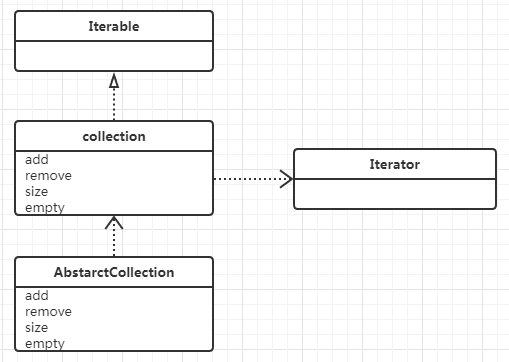

## 类图


## 定位
实现接口Collection的方法。jdk 的集合分为两类:有序的list 和 set(相当于数学中的集合)。list和set继承此类，该类是list 和 set 公共实现方法的抽象。    

## 源码分析
```
    public boolean contains(Object o) {
        Iterator<E> it = iterator();
        if (o==null) {
            while (it.hasNext())
                if (it.next()==null)
                    return true;
        } else {
            while (it.hasNext())
                if (o.equals(it.next()))//防止it.next为空
                    return true;
        }
        return false;
    }
``` 
使用Iterator迭代器，分对象为null和不为null两种情况讨论。使用eauals方法；且o.equals(it.next())防止了it.next为空。   
```
    public boolean remove(Object o) {
        Iterator<E> it = iterator();
        if (o==null) {
            while (it.hasNext()) {
                if (it.next()==null) {
                    it.remove();
                    return true;
                }
            }
        } else {
            while (it.hasNext()) {
                if (o.equals(it.next())) {
                    it.remove();
                    return true;
                }
            }
        }
        return false;
    }
```
使用iterator迭代器，继续分两种情况讨论，使用迭代器it的remove方法，实现remove。   
```
    public Object[] toArray() {
        // Estimate size of array; be prepared to see more or fewer elements
        Object[] r = new Object[size()];
        Iterator<E> it = iterator();
        for (int i = 0; i < r.length; i++) {
            if (! it.hasNext()) // fewer elements than expected
                return Arrays.copyOf(r, i);
            r[i] = it.next();
        }
        return it.hasNext() ? finishToArray(r, it) : r;
    }
    public Object[] toArray() {
        // Estimate size of array; be prepared to see more or fewer elements
        Object[] r = new Object[size()];
        Iterator<E> it = iterator();
        for (int i = 0; i < r.length; i++) {
            if (! it.hasNext()) // fewer elements than expected
                return Arrays.copyOf(r, i);
            r[i] = it.next();
        }
        return it.hasNext() ? finishToArray(r, it) : r;
    }
    private static <T> T[] finishToArray(T[] r, Iterator<?> it) {
        int i = r.length;
        while (it.hasNext()) {
            int cap = r.length;
            if (i == cap) {
                int newCap = cap + (cap >> 1) + 1;
                // overflow-conscious code
                if (newCap - MAX_ARRAY_SIZE > 0)
                    newCap = hugeCapacity(cap + 1);
                r = Arrays.copyOf(r, newCap);
            }
            r[i++] = (T)it.next();
        }
        // trim if overallocated
        return (i == r.length) ? r : Arrays.copyOf(r, i);
    }

```
toArray的方法，考虑了多线程的情况。 *if (! it.hasNext())*当转的时候有其他线程remove，直接拷贝返回；*return it.hasNext() ? finishToArray(r, it) : r;*当转的时候有其他线程add，再调用finishToArray
```
    public boolean add(E e) {
        throw new UnsupportedOperationException();
    }
```
add方法留到具体类里面实现。

## 代码抽象
1：contain、remove都是基于Iterator来实现，在contain中使用equal判等；     
2：contain、remove都对元素做了判空处理，因此*判空处理*是写代码的路径之一；     
3：toArray考虑了多线程环境下的处理，多线程也是写代码的路径之一；     