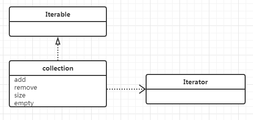

## 类图

## 定位
对集合类的高度抽象，定义了集合的必要方法：增加、删除、查询、遍历、大小、判空   

|增加|删除|查|转|容器原生|
|---|--:|--:|---|---|  
|add|remove|contain|toArray|size|
|addall|retain|iterator||empty|
||clear||||

### 注意
remove 移除传入集合的元素   
retain 移除不在传入集合的元素，相当于求交集   
clear 移除全部元素  

